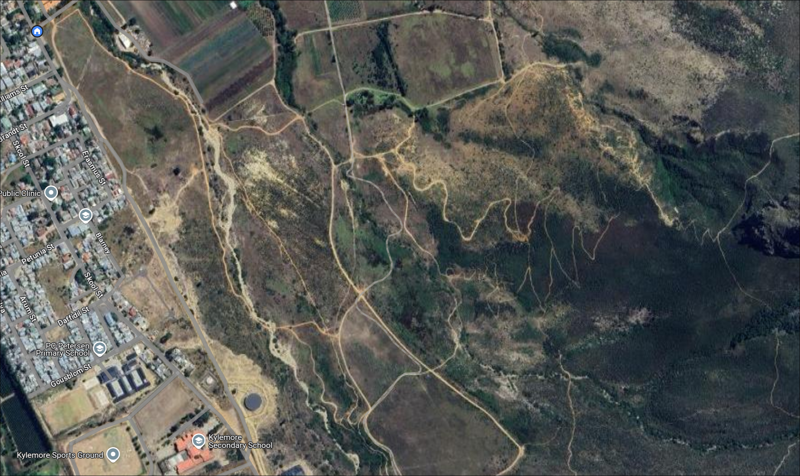

# BethlehemBouldering

A simple guide to bouldering on my farm.

## Background and Info

Iben asked me to make this for anyone interested in bouldering at my farm. This should help anyone who aspires to that goal.

As the boulder sits in [Bethlehem Plaas](https://maps.app.goo.gl/TPZWeMC4AntFpdBFA), opening hours vary. However, when the farm is open you are free to walk in to the boulder without my knowledge. If you want to get *car* access, please contact myself at <jacobenthoven@gmail.com>. More in depth access information is contained below.

## Access and Location

Here is the [precise location](https://maps.app.goo.gl/9GXsPRcMXdio4FMZ6) of the boulder. The standard route to get there by foot and car is shown below.

