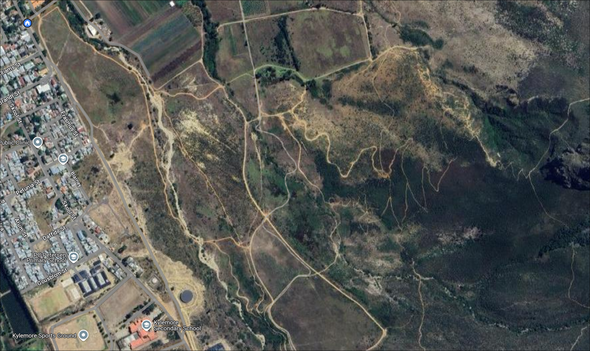

# BethlehemBouldering

A simple guide to bouldering on my farm.

## Background and Info

Iben asked me to make this for anyone interested in bouldering at my farm. This should help anyone who aspires to that goal.

As the boulder sits in [Bethlehem Plaas](https://maps.app.goo.gl/TPZWeMC4AntFpdBFA), opening hours vary. However, when the farm is open you are free to walk in to the boulder without my knowledge. If you want to get *car access*, please contact me at <jacobenthoven@gmail.com>. More in depth access information is contained below.

## Access and Location

Here is the [precise location](https://maps.app.goo.gl/9GXsPRcMXdio4FMZ6) of the boulder. The standard route to get there by foot is shown below (for car access please contact me).

## Routes

Here are all the sides of the boulders and their routes. The star ratings are out of ⭐⭐⭐ and *ss* means sit start.

### Left Side

|no.|name|stars|first ascensionist|description|
|-|-|-|-|-|
|1.| Dark Side 6a | ⭐⭐|Jacob| A nice warmup. Start on obvious jug with bad feet and traverse around the corner on underclings. Spicy finish!|
|2.| Font 6b 7a | ⭐⭐|Jeremy| Start as for Dark Side. Do a hard move to a crimp and mantel out right.|
|3.| Understand 7c | ⭐⭐|+Dom| Stand start to Standunder. Starts left hand on thin crimp, and right hand on a sloper.|
|4.| Standunder 7c+ | ⭐⭐⭐|Dom| Visionary line. Sit start to Understand. Starts sitting, a few moves till you use an obscure undercling with a perfect body position that unlocks this vision.|
|5.| The last melon project|`?`|`?`| The only possible remaining project on this boulder. Lets see what the future holds...|
|6.| C'est la vie 7b+ |⭐⭐|Dom|  An optional extra. Starts on the ledge, using a sidepull-undercling and an obscure kneebar to unlock the move to the sloper on the lip. Traverse right into Golden Boy.|
|7.| Golden Boy 7b+ |⭐⭐|Dom| Morpho! Stand up on bad undercling and use sloper on the lip and reach to find the hold. Alternative beta is to use a heel toe cam and match the sloper. Same difficulty both ways.|
|8.| Early Bird Gets the Worm 8a |⭐⭐|Dom| The bad gaston in the spoon is sufficient! Start on the ledge, move up right to a semi gaston pinch with the right hand, into the small gaston in the spoon.|

### Main Face

|no.|name|stars|first ascensionist|description|
|-|-|-|-|-|
|9.| Ladyboy Left 7b |⭐|Dom| Same as Ladyboy, but peel out left before the top moves.|
|10.| Ladyboy 7b |⭐⭐⭐|Jacob| (Arguably) The best climb on the bloc! Sit start on the jug and climb straight up. Big committing move on a bad crimp to finish.|
|11.| Paddaman 7c+ |⭐⭐⭐|Ben| The 👑 line! Start as Ladyboy and break into the middle of the face on the sloper rail. Finish straight up with a large move off a slopey gaston crimp.|
|12.| Full Frontal 7c |⭐⭐⭐|Ben| Start as Ladybug and pull into Paddaman via a large jug in the face.|
|13.| Paddawan 7c |⭐⭐|Jacob| Climb as Paddaman until the final move and exit onto the right arete via thin holds and high heel. More committing than Paddaman.|
|14.| Clemen Gold 7b+ |⭐⭐|Dom| Climb as Full Frontal but end as Paddawan. Fun linkup.|
|15.| Drag 7a+ |⭐|Jacob| Start as Ladyboy and finish as Ladybug via the large jug in the face. |
|16.| Ladybug 6c |⭐⭐⭐|Jacob| Dyno out to the sloper in the face and follow the seam right.|
|17.| The Inner Machinations of my Mind are an Enigma 7a |⭐⭐|Luke Eberhard|  The first climb done on the bloc. Climb straight up the arete via some fun compression.|
|18.| Black Belt 7b+ |⭐⭐|Dom| Another obscure line. Crouch start, into two small side pulls, out to a sloping rail, and then karate kick out left before the lip. Fun one!|

### Right Side

|no.|name|stars|first ascensionist|description|
|-|-|-|-|-|
|19.| Guillotine 6b |⭐|Bastie| Great for the girlfriends ;). Crouch start on triangular jug, up to some opposing crimps, and through the holds in the roof to the lip. Perhaps avoid using the big loose block?|
|20.| Dogshit 7b | |Jacob| Sit start with an undercling, out left to a rail and a small pocket, into compression. Top-out as Guillotine.|
|21.| Turn the other cheek 6a | |Dom| Again, great for the girlfriends ;). Traverse up the slopers on the edge. Top-out as Guillotine.|
